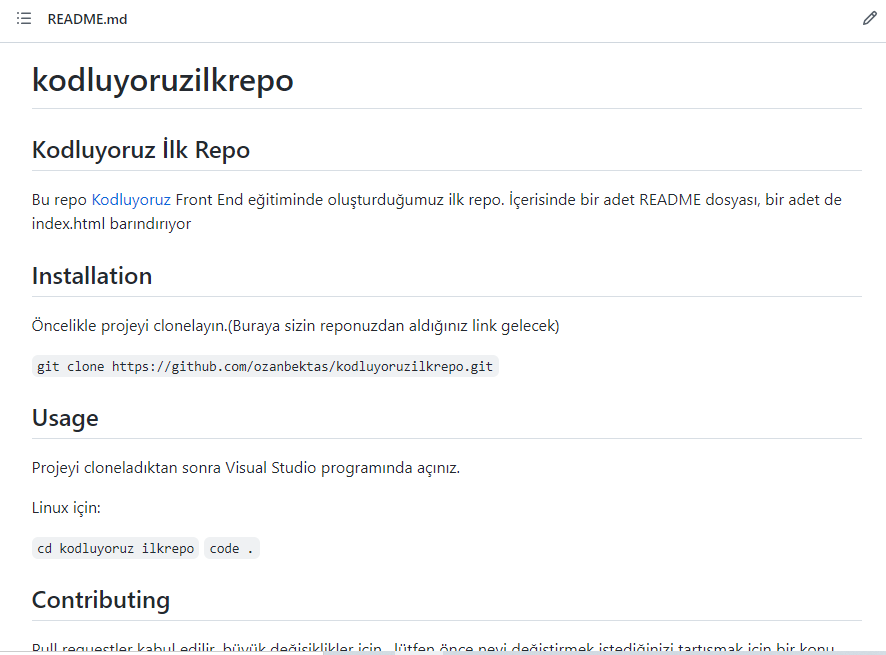

# kodluyoruzilkrepo

## Kodluyoruz İlk Repo

Bu repo [Kodluyoruz](https://kodluyoruz.org/tr/kodluyoruz/) Front End eğitiminde oluşturduğumuz ilk repo. İçerisinde bir adet README dosyası, bir adet de index.html barındırıyor

## Installation

Öncelikle projeyi clonelayın.(Buraya sizin reponuzdan aldığınız link gelecek)

`git clone https://github.com/ozanbektas/kodluyoruzilkrepo.git`

## Usage

Projeyi cloneladıktan sonra Visual Studio programında açınız.

Linux için:

`cd kodluyoruz ilkrepo`
`code .`

## Contributing

Pull requestler kabul edilir. büyük değişiklikler için , lütfen önce neyi değiştirmek istediğinizi tartışmak için bir konu açınız.

## License

[MIT](https://choosealicense.com/licenses/mit/)

[PatikaDev](www.patika.dev)